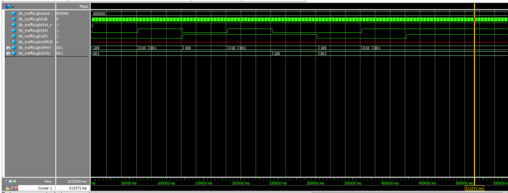
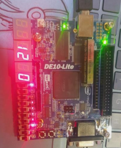

# Traffic Light Controller Using FPGA

This repository contains a traffic light controller implementation using an FPGA board and Verilog. The project was completed during my 4th semester as a mini-project.

## Project Description

The project involves designing a traffic light controller with the following functionalities:
- A highway with a pedestrian crossing and a road leading to a hospital.
- Vehicles from the hospital road have higher priority and trigger the traffic light to turn yellow and then red to stop highway traffic.
- Pedestrians waiting for more than 20 seconds trigger the traffic light to turn red, allowing them to cross the road.
- The system ensures that hospital vehicles have priority over pedestrians.

### Problem Statement

There is a pedestrian crossing on the highway and a road to the hospital through the highway. When there are vehicles from the hospital road, the traffic light should be yellow and then should turn into red to stop any vehicles that are on the highways. Otherwise, it should be green. If any pedestrians are waiting at the crossing for more than 20 seconds, the traffic light should turn to red to allow the pedestrians to cross the road. Vehicles from the hospital road have more priority than pedestrians. If there are pedestrians at the crossing and also vehicles coming from the hospital road, how will you stop the pedestrians from crossing the road? This scenario is implemented using VHDL with proper explanations for chosen time periods for both yellow and red signals.

## Project Details

### Hardware and Software Requirements
- FPGA Board
- Quartus Prime Lite Edition Software
- ModelSim for simulation

## Output Images

### Simulation Results (ModelSim)

Here are some images of the simulation results demonstrating the traffic light sequences:

*ModelSim Output*

### FPGA Board Video Output

Here are some images of the FPGA board video output demonstrating the traffic light sequences:

*FPGA Board Output*
